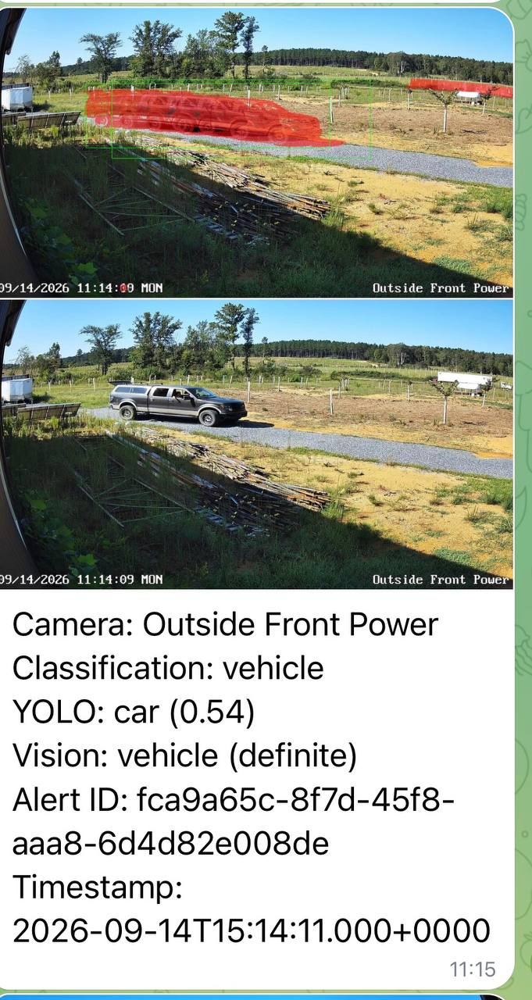
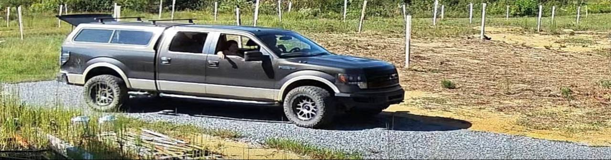
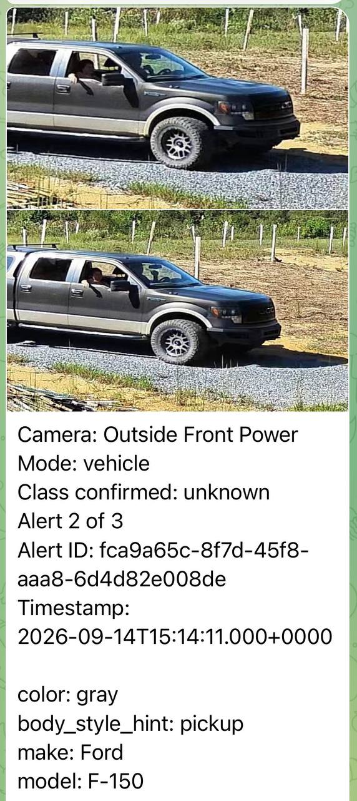
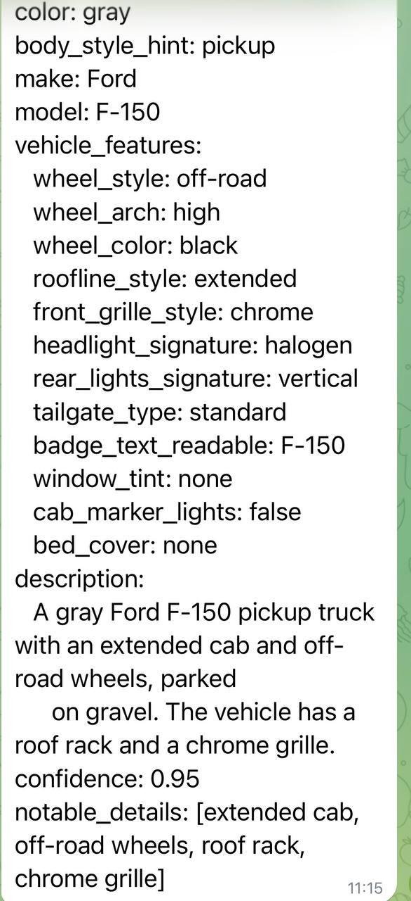
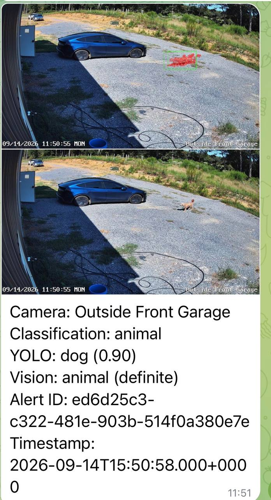
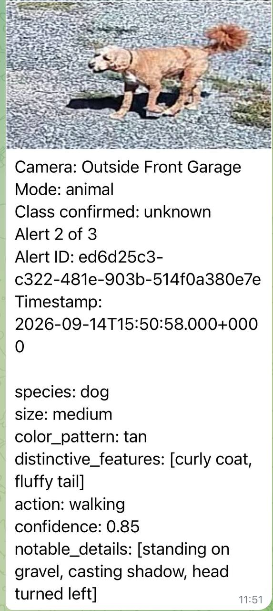

# farm-surveillance-v2

Linear-pipeline webhook consumer for farm IP cameras. Receives
Reolink motion alerts, runs an 11-stage processing pipeline, fires
Telegram notifications on subject detection and match results.

> **Status:** v2 daemon live on port 8090; delivering real alerts.
> Current PRD ([PHASE-V2-017](docs/PHASE-V2-017-PRD-rtsp-robustness-and-delivery.json))
> complete as of 2026-09-08 — registry prefix key, telegram env loading,
> scheduled_reconnect_watchdog, max_reconnect_attempts cap.

## What this is

A small Python service that:

1. Listens on `:8090/alert` for Reolink motion webhooks (IP-validated)
2. Captures 4 frames around the motion event from a continuous per-camera
   RTSP ring buffer (180-frame lossless-ish JPEG ring per camera)
3. Runs a YOLO gate to filter noise vs real subjects
4. Verifies subject class via vision-LLM (Qwen3-VL on `:8080`)
5. Asks vision-LLM for class-specific detail
6. Sends three Telegram notifications: alert, detail, optional match
7. Throttles per-`(camera, classification)` to avoid alert storms

Pipeline shape in [`docs/PLAN.md`](docs/PLAN.md). PRDs by phase in
[`docs/PHASE-V2-*.json`](docs/).

## What alerts look like

When a camera sends a motion webhook, the pipeline runs end-to-end and
delivers up to three Telegram notifications: an alert with the wide
frame and motion box, a cropped detail image of the moving subject,
and (if the subject is recognized) a structured match result.

Example: a dark gray Ford F-150 driving down the gravel driveway.

| 1. Alert + motion box (wide frame) | 2. Cropped subject |
|---|---|
|  |  |
| Two-frame stack from the camera. Red box = where motion was detected. | Same event, cropped to just the moving vehicle. |

| 3. Closer crop (second angle) | 4. Recognized subject + attributes |
|---|---|
|  |  |
| Closer view of the same vehicle as it passes. | Vision-LLM structured output: color, body style, make, model. |

The crop is the part of the pipeline that earns its keep: when multiple
vehicles are visible in the wide frame (parked + moving), the crop
selector only sends the **moving** one to Telegram, not every vehicle
in frame. Same for animals — the pipeline crops to the animal, not
the whole scene.

Example: a small fluffy dog crossing the gravel.

| Wide frame + motion box | Cropped detail |
|---|---|
|  |  |
| Same two-frame pattern; motion box over the dog. | Vision-LLM cropped to just the dog. |

Telegram format and alert wording are documented in
[`telegram_formatter/`](telegram_formatter/).

## Reolink camera setup

This daemon expects Reolink cameras to POST motion alerts to its
`/alert` webhook. Each camera must be wired up twice: once on the
camera's web UI (motion alerts enabled, webhook URL configured,
framerate set), and once in `camera-creds.env` so the daemon can
validate incoming requests and pull frames from the camera's RTSP
stream.

This section is a working overview. Model-specific quirks (RLC-510A
vs RLC-833A, firmware differences) live in operator playbooks — this
README covers what works on modern firmware across both.

### 1. Enable push notifications on the camera

Open the camera's web UI (`http://<camera-ip>/`, log in with admin
credentials). On Reolink models with firmware v3.0.0+:

- Click the **gear icon** (top-right). On some models, only a
  center-click on the gear opens the full settings panel — a click
  on the icon's edge may open a stripped-down view that hides the
  Push and webhook controls.
- Click **Surveillance → Push**.
- Toggle **Push Notifications** ON.

If your camera runs older firmware, this toggle may not appear in
the gear panel — use the Reolink mobile or desktop app to enable
push notifications per camera.

### 2. Configure the webhook URL

On the same Push page, scroll to **For Developer → Webhook**:

- Click **Add**.
- Enter the webhook URL: `http://<daemon-host>:8090/alert`
  (default daemon port is `8090`; override with `LISTEN_PORT`).
- Save.

The URL must be reachable from the camera's network. If the camera
is on `192.168.1.x` and the daemon is on a separate machine,
configure port forwarding or run the daemon on the camera's subnet.

### 3. Set framerate

Lower framerate = less RTSP bandwidth + lower motion-detection load.
Set the **main stream** to **6 fps** as a starting point
(bandwidth-friendly, plenty for vehicle/person detection).

The easiest path is the camera's web UI under
Settings → Stream → Encode (or via the CGI `SetEnc` endpoint on
supported firmware). Note: on RLC-510A v3.2.0+, only even fps values
are accepted (`[2, 4, 6, 8, 10, 12]`) — odd values return a
`param error`.

### 4. Wire the camera into camera-creds.env

The daemon rejects webhook requests from unknown camera IPs.
Add one stanza per camera to `camera-creds.env` (mode 600, never
committed). Template:

```bash
# Front door camera
FRONT_IP=192.168.1.39
FRONT_HTTP_USER=admin
FRONT_HTTP_PASS=<admin password>
FRONT_RTSP_USER=admin
FRONT_RTSP_PASS=<camera admin password>
FRONT_RTSP_URL=rtsp://admin:<password>@192.168.1.39:554/h264Preview_01_main
```

The camera's friendly name in the OSD must match one of the
recognized keys: `FRONT, BACK, OUTSIDE_FRONT_GARAGE,
OUTSIDE_FRONT_POWER, OUTSIDE_FRONT_SOLAR, OUTSIDE_BACK_SOLAR`.
To add a custom name, edit the `_CAMERA_MAP` dict in
`infra/camera_creds.py`.

### 5. Verify the webhook is firing

From the daemon host:

```bash
tail -f logs/daemon.log
```

Then walk in front of the camera. Within ~20s (the default push
interval), you should see:

```
POST /alert from <camera-ip>
```

If you see `IP mismatch`, the daemon recognized the camera name
but the source IP didn't match — check `FRONT_IP` in
`camera-creds.env` matches the camera's actual LAN IP.

## RTSP robustness

Each camera has its own `PersistentRTSPReader` (in
[`infra/frame_capture.py`](infra/frame_capture.py)) with two defense-in-depth
watchdogs (US-017d / US-017e):

| Mechanism | Cadence | Source |
|---|---|---|
| `scheduled_reconnect_watchdog` | every `FARMSV_RTSP_RECONNECT_SECONDS` (default 3600s) | proactive close+respawn |
| `max_reconnect_attempts` cap | after `FARMSV_RTSP_MAX_RETRIES` (default 10) consecutive failures | cap-and-defer to watchdog |

Plus the existing `CameraCaptureRegistry._reconnect_loop` for
cross-reader registry-level recoveries. Ported from v1 refactor `<V1_REPO_PATH>/infra/persistent_rtsp.py`.

## Diagnostics

- `GET /debug/rtsp` — per-reader ring size, decoded total, last-frame age,
  container-open, health flag, error count
- Unified log: `logs/daemon.log` (single stream, plist routes stdout here)
- `pytest tests/ -x --tb=short` — 122 tests passing

## Layout

```
infra/                   # shared modules: gate, frame_capture, cooldown, schemas
listener/                # webhook receiver + linear pipeline (live, port 8090)
vehicle_position/        # trajectory + crop extraction
telegram_formatter/      # Telegram stage formatters
tests/                   # pytest (122 tests)
docs/                    # PLAN.md, V2-LIFT-PLAN.md, PHASE-V2-*.json
camera-creds.env.example # template for camera credentials
telegram-creds.env.example # template for Telegram credentials
llm-creds.env.example    # template for vision-LLM endpoint
```

## Configuration

Env files are mode 600 and **never committed**. Daemon reads them at
boot from these locations:

| File | What | Loaded by |
|---|---|---|
| `camera-creds.env` (repo root) | per-camera IP / HTTP user+pass / RTSP user+pass+url | `infra/camera_creds.py` |
| `~/.env` (user home) | `TELEGRAM_BOT_TOKEN`, `TELEGRAM_HOME_CHAT_ID`, plus 26 other keys | `listener/daemon.py::_load_home_env` (added in US-017b) |

`*.env.example` files at the repo root are the templates. Copy,
fill in real values, mode 600, never commit.

Other env vars honored at runtime:

| Var | Default | Purpose |
|---|---|---|
| `LISTEN_HOST` | `0.0.0.0` | webhook bind |
| `LISTEN_PORT` | `8090` | webhook bind |
| `VISION_LLM_URL` | `http://127.0.0.1:8080` | Qwen3-VL endpoint |
| `LOG_LEVEL` | `INFO` | log level |
| `FARMSV_RTSP_RECONNECT_SECONDS` | `3600` | US-017d watchdog cadence |
| `FARMSV_RTSP_MAX_RETRIES` | `10` | US-017e cap-and-defer threshold |

## Daemon management

The v2 daemon runs under launchd as `com.farm.surveillance.v2`. Plist:
`<HOME_DIR>/Library/LaunchAgents/com.farm.surveillance.v2.plist`.

```bash
# view status
launchctl list | grep com.farm.surveillance.v2
tail -f logs/daemon.log

# bounce (requires explicit operator approval at the moment of bounce)
kill <PID>
launchctl load <HOME_DIR>/Library/LaunchAgents/com.farm.surveillance.v2.plist
```

`KeepAlive: true` in the plist means launchd respawns automatically on
exit. The plist does **not** carry Telegram credentials — those load
from `~/.env` at boot.

## Development

Requires Python 3.11. Setup:

```bash
./.venv/bin/python3.11 -m pip install -e .
./.venv/bin/python3.11 -m pytest tests/ -x --tb=short
```

The 122-test suite covers:

- `/alert` route (with IP validation, payload shape, motion gate hookup)
- Camera registry prefix-key fix (single reader per camera)
- `~/.env` loading at daemon boot
- `scheduled_reconnect_watchdog` lifecycle (mock container, advance time)
- `max_reconnect_attempts` cap-and-defer (always-raise mock decoder)

## PRDs

Each phase is a numbered PRD in `docs/PHASE-V2-*.json`. Current state:

| PRD | Phase | Status |
|---|---|---|
| PHASE-V2-CORE | pipeline buildout | done |
| PHASE-V2-014 | camera webhook activation | done |
| PHASE-V2-016 | diagnostic visibility + boot hardening | done |
| PHASE-V2-017 | rtsp robustness + telegram delivery | done |

## License

Operator-private for now. License TBD before public squash release.


## Telegram home chat env var name
The canonical env var name is `TELEGRAM_HOME_CHAT_ID`, **not** `TELEGRAM_CHAT_ID`. If your `~/.env` has the wrong name, the dispatcher will raise `ConfigError` with the exact rename step on every alert. Verify with:
```bash
python3 -c 'from dotenv import dotenv_values; from pathlib import Path; print(bool(dotenv_values(Path.home() / ".env").get("TELEGRAM_HOME_CHAT_ID")))'
```
If this prints `False`, rename `TELEGRAM_CHAT_ID` to `TELEGRAM_HOME_CHAT_ID` in `~/.env`.
